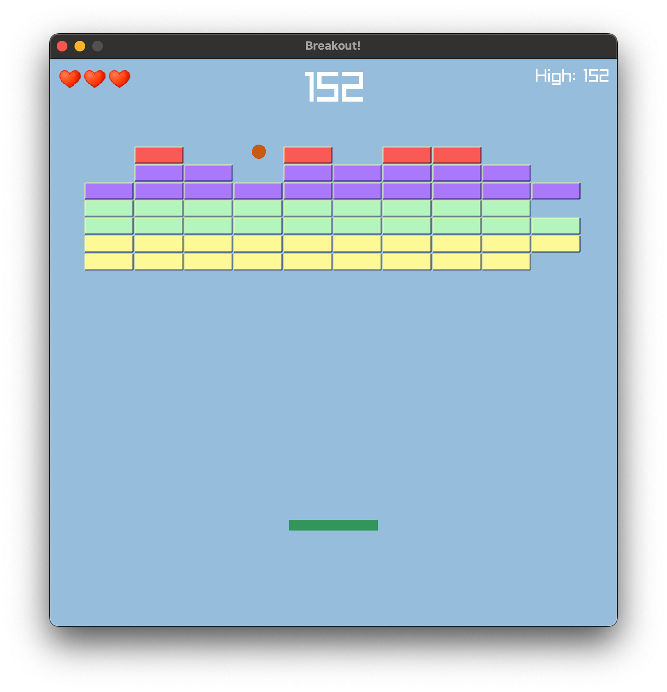

# Breakout

This is a classic `Breakout` game implementation, adapted from the excellent Youtube video: [Odin + Raylib: Breakout game from start to finish](https://www.youtube.com/watch?v=vfgZOEvO0kM)  by Karl Zylinski.



## Compile and run the game
- [Install the Go compiler](https://go.dev/learn/)
- Enter the `breakout` folder and run:
  ```
  go build
  ./breakout
  ```
  This will compile and run the breakout code.
- assets like sounds and images are expected in the assets folder

## TODO

- ~Add sound(s)~
- Highscore
  - ~Add to UI~
  - Persist Highscore
  - Add usernames for highscores
- Levels
  - ~After clearing a level, go to a new/next one~
  - ~Create different (shapes) of levels~
- Blocks
  - ~'hard' blocks that must be hit more than once~
  - blocks that drop a special token, when hit with the paddle it will be enabled:
    - 'extra life' block
    - 'multiple balls' block
    - 'extended paddle' block
- Refactor code
